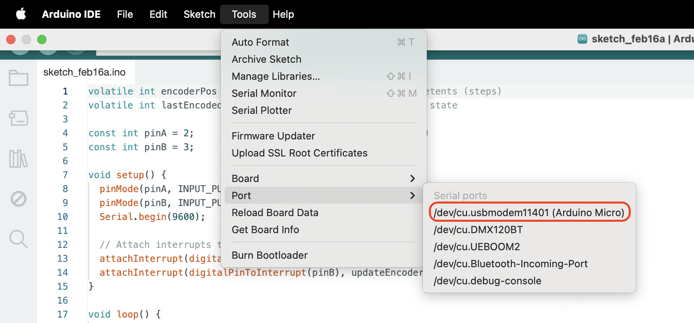
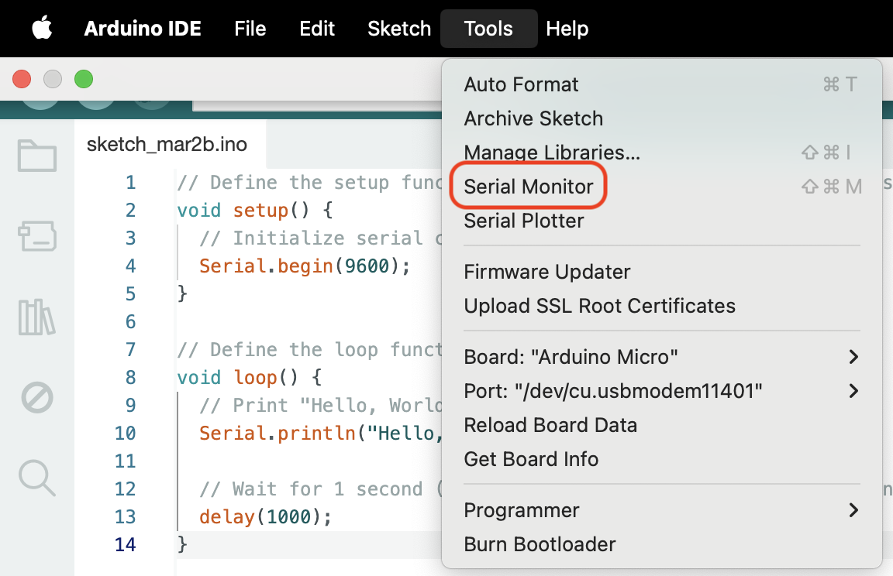

# Arduino Micro With Rotary Encoder

This is a project showing how to use an Arduino Micro with a rotary encoder. The rotary encoder is used to count the number of rotations and the direction of rotation. The Arduino Micro is used to read the encoder and send the data to a computer over USB.

- Encoder: Photoelectric Speed Sensor Encoder Coded Disc code wheel For Freescale Smart Car

## Connect

1. Open the Arduino IDE
2. Connect the Arduino Micro to your computer using a USB cable
3. Select the Arduino Micro board from the Tools > Board menu
4. Connect to the board via the port 
5. View the logs in the Serial Monitor 
